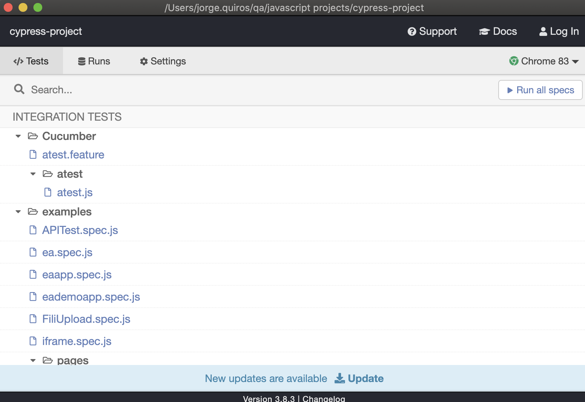

Cypress automation project
==========================

Installation
------------

- Need to have npm in your machine (nodejs)
- Run npm install to install all the packages in your package.json
  - It will create the node_modules which you don’t have in git (as you have it in gitignore), just run npm install once you clone the project and it will create the dependencies in your machine
- Run 'npm outdated' to see if you have outdated packages
- Run 'npm i -g npm-check-updates' to install the updates checking
- Run 'ncu -u' to see available updates
- Run 'npm install' again to update those

Running in desktop
-----------------

- Open with visual code
- You can use npx to run binaries, in case of cypress is very handy so just type (npm should be greater than 5.2)
  - npx cypress open (npm should be greater than 5.2)

  
  - It will open a playground for you, with examples, also it creates a folder in your project called cypress
  
  - You can click any of these examples in the playground to see what happens

- Also to add your own code you can use the /integration/examples folder

- You can also run it from command line, it will give you statistics about the runner
  - Npx cypress run --spec pathtofile/file.js
  - additionally you can use --browser chrome to run it in non headless mode

Running with Github Actions
---------------------------

- Make sure you have the spec.js file you want to test within scripts in package.json
- 

How it runs
-----------

- It uses blocks called ‘IT’, each ‘it’ is like an scenario
- You can use either describe (this is the method) or context (which is the alias of describe)
- If you have any example opened in the Cypress playground and change the code it will automatically execute it and check for the elements in real time, without having to run it again (no waiting, no stopping and running again, no drivers for Selenium)
- The open selector playground helps to identify elements without doing anything!
- Time traveling is the feature that allows you to move between all the steps in the browser window for Cypress where you can see the different steps in real time

